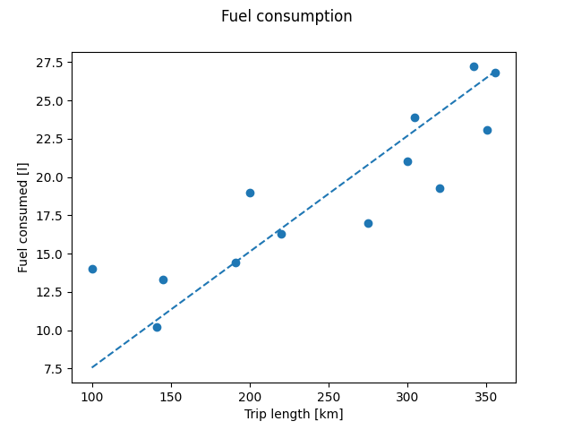

## Programozás alapjai 2.

### 1. Zárthelyi dolgozat pótlása

A feladat egy gépjármű üzemanyagfogyasztásának elemzését segítő osztályok elkészítése a [fuelstats.py](fuelstats.py) fájlban.

A fogyasztási adatok `Trip` objektumokban legyenek tárolva.
Konstruktorban kerül megadásra a megtett út hossza km-ben és az üzemanyagfogyasztás literben.
Legyen egy `lit_per_100k()` metódusa, ami kiszámolja és visszaadja, hogy ez 100 km-en hány liter fogyasztással egyenértékű.
Az adatok könnyebb rendezésének érdekében legyen összehasonlítás operátora, ami a megtett út alapján hasonlít össze két objektumot.

A `FuelStats` osztály tudjon tárolni `Trip` objektumokat.
Az `add(Trip)` metódussal lehessen újat hozzáadni.
A konstruktornak megadott pickle fájlból töltse be az adattagokat.
Ha a fájl nem létezik, akkor üresként inicializálja az objektumot, amihez majd később lesznek adatok adva.
A fájlnevet pedig mentse el a későbbi fájlba mentéshez, amit a `save()` metódus csinál (ez már nem kér fájlnevet).

Az `average()` és a `median()` metódusok adják vissza az átlagos fogyasztást, illetve a `Trip` objektumok közül a mediánnak a fogyasztását, l/100km-ben.
A medián a fogyasztás szerinti rendezés utáni középső elem értéke, vagy páros darabszám esetén a két középső érték számtani közepe.

A `create_chart()` metódus aza alább leírt módon készítsen grafikont az utazásokból, és azt mentse el egy fájlba.

A grafikont az aktuális könyvtár `plots` alkönyvtárába tegye, ha nincs ilyen, hozza létre.
A fájlok itt `0.png`, `1.png`, `2.png`, `3.png`, ... elnevezésűek legyenek.
Ehhez nézze meg, mi a legnagyobb "sorszámú" fájl, és annál eggyel nagyobb legyen az aktuális fájl neve.
A könyvtárban lehetnek olyan fájlok is, amiknek a neve nem egy szám, ezeket hagyja figyelmen kívül.

A grafikon X tengelye az utazások hossza, az Y tengelye a fogyasztás literben, ezek legyenek is kiírva a tengelyekre, valamint a grafikon tetején legyen egy cím.
Az egyes utazások értékei pontokként legyenek ábrázolva, és az átlagfogyasztás pedig egy egyenes, szaggatott vonalként kerüljön feltüntetésre.
Példa kimenet a megadott tesztadatokra:

A ZH során használható weboldalak:
* Órai kódok repository-ja: https://github.com/Uni-Sopron/progalap2-22t
* Saját házi feladat megoldások: https://github.com/Uni-Sopron?q=progalap-22t-hf
* Python Tutor: https://pythontutor.com/visualize.html
* Hivatalos Python dokumentáció: https://docs.python.org/3/library/index.html
* W3Schools: https://www.w3schools.com/python/
* Programiz: https://www.programiz.com/python-programming
